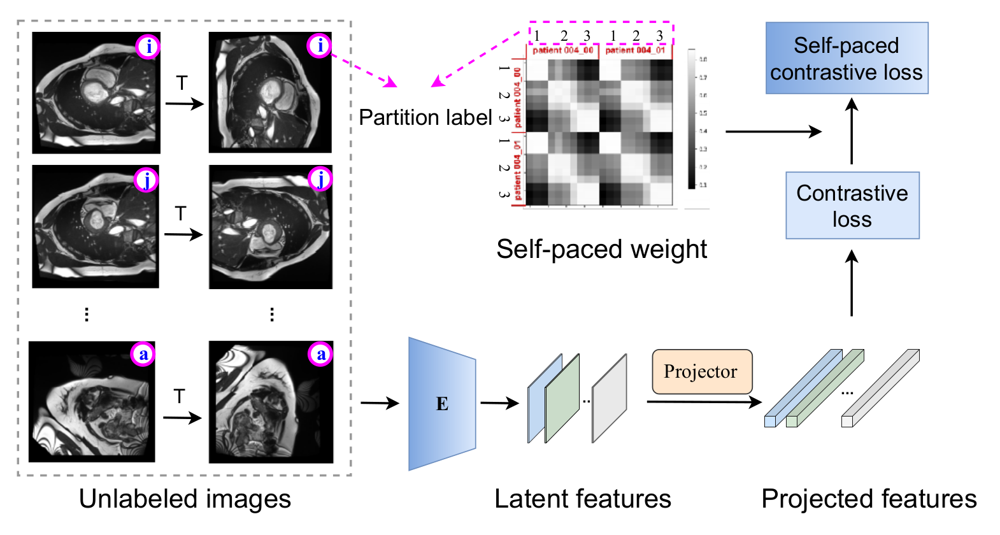
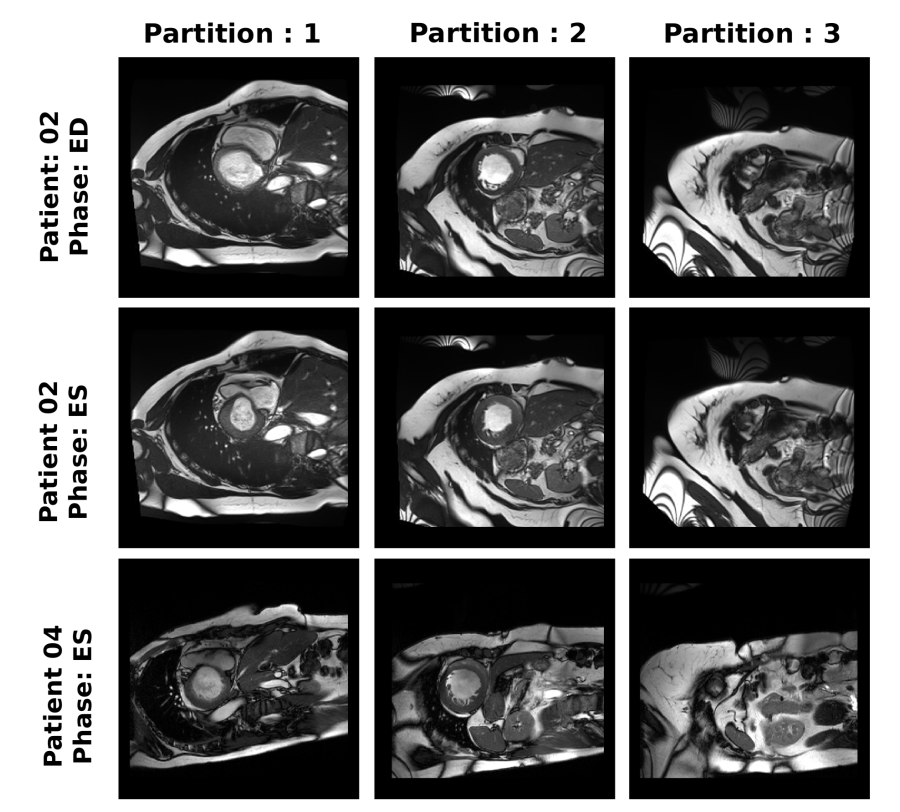

## Self-Paced Contrastive Learning for Semi-supervised Medical Image Segmentation with Meta-labels

---------

This is the codebase that reproduces the results (Tab.2 and Tab.3) for the paper "Self-Paced Contrastive Learning for
Semi-supervised Medical Image Segmentation with Meta-labels" (https://arxiv.org/abs/2107.13741)
accepted at Neurips 2021 conference.

------------

We have proposed a self-paced enhanced contrastive learning that helps the network to generalize with noisy meta-labels
(defined as pretext tasks under form of supervised contrastive learning).

Our pretrain loss can be described as
where we introduce a weighting mechanism ([code](contrastyou/losses/contrast_loss3.py)) to weight pairs based on their
learning difficulty and model's maturity.

-----------------

In this algorithm, we explore the meta-labels for 2D slices intrinsically coming from 3D scans, including

* slice position,
* patient (scan) id,
* cardiac phases.

The three meta-labels are interpretable from the next figure.


We also showed that combining the three meta-labels can boost the performance in a semi-supervised setting.

-----

#### Running guidance

The whole codebase is packaged as `contrastyou` and you must install it by

```bash
pip install -e .
```

The requirements are listed in the requirements.txt and to install them:

```bash
pip install -r requirements.txt
```

The scripts are provided in the `script` folder.

One should modify it according to its need and the results should be similar for those we reported in the paper.
We reported the values using average of three different random seeds.

--------

#### Questions:

Please raise issues or send emails to `jizong.peng.1@etsmtl.net`.


